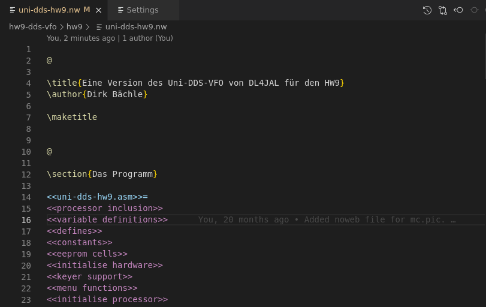
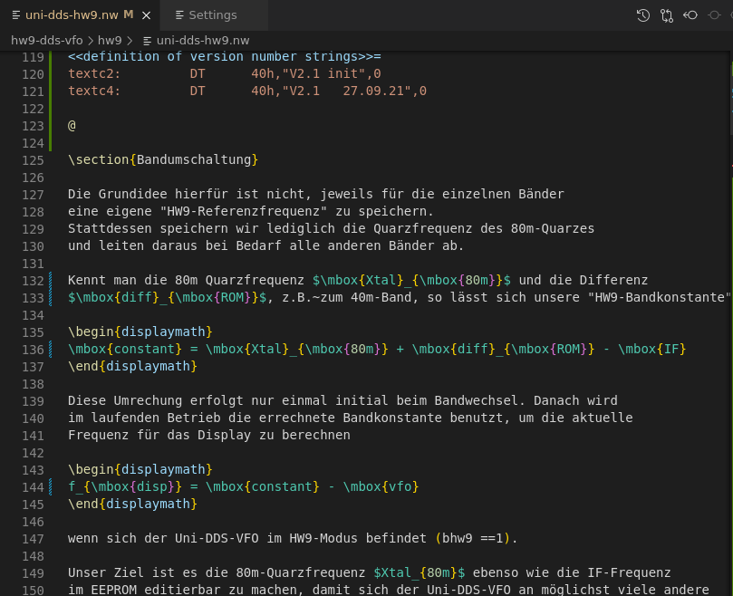
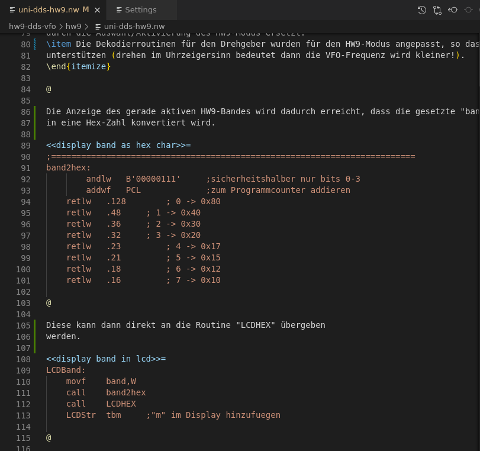
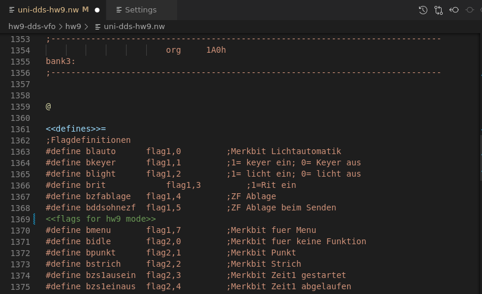
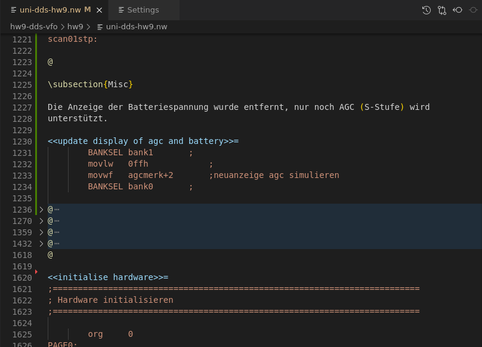

# Noweb Literate Programming Extension for Visual Studio Code

This is an extension for Visual Studio Code, supporting
[Literate Programming](http://www.literateprogramming.com) using
the [Noweb](https://www.cs.tufts.edu/~nr/noweb/) tool written by Norman Ramsey.

Its main goal is to provide a somewhat decent syntax highlighting for *Noweb* files.

**Note**: This is a work in progress and has been tested with Noweb versions 2.x only. There
currently are no tests provided, however the extension was manually tested against the
syntax of all the example files in https://github.com/nrnrnr/noweb/tree/master/examples.

## Features

- Basic syntax highlighting for *Noweb* keywords. The TeX sections are delegated to the
  internal LaTeX highlighting grammars of VS Code.
- Detects and colorizes undefined *Noweb* keywords.
- Basic folding support.
- Auto-completion for `<<>>` brackets.

## Known Issues

- *Noweb* common file extensions, `.nw` and `.noweb`, may conflict with other tools.
- The used token types, and therefore the items' colors, have been tested with the "Dark+"
  theme only. Token colors may clash or be undistinguishable when using a different theme.
- The current parsing assumes that the start of a new chunk (`@` in first column) and a
  possible keyword definition, appear in separate lines. So, a very condensed syntax
  `@<<\fIchunk name\fP@>>=`, like in `manpage.nw` of the original *Noweb* sources,
  isn't detected correctly.

  This is easily fixable in the `.nw` file by pressing the `Return` key once, so at the moment
  I don't plan to do anything about it.
- Since we simply direct all LaTeX parsing to the internal grammars, the *Noweb*-specific
  inline command `[[]]` is unknown to VS Code. Only the surrounding brackets will get
  highlighted, as throughout the rest of the `.nw` file. In addition, a sequence like `[[%token]]`
  will start a LaTeX comment until the end of the current line.

  I'm happy with the rest of the LaTeX parsing and don't plan to do anything about this minor
  issue at the moment.

## Used token types

In the '`Token`' column of the following table, the first string denotes the actual type
while the optional `[]` brackets contain the modifier(s).

| Regex | Token | Meaning |
|-------|-------|---------|
| `/^@\s*.*$/` | function[declaration] | The start of a new *Noweb* chunk |
| `/^<<(.*)>>=\s*$/` | variable | Definition of a keyword |
| `/^<<(.*)>>+=\s*$/` | variable | Addition to a keyword |
| `/<<(.*?)>>/g` | keyword | Reference to a defined keyword |
| " | comment | Reference to an undefined keyword |
| `.*` | string | All other text in a code section, meaning the 'code' itself |

## Screenshots

The following images were taken while working on one of my own projects: 
["*Re-programming the PIC for a DDS-VFO in Assembler*"](https://github.com/dirkbaechle/hw9-dds-vfo) (in German).

### Basic view

The basic parsing and the highlighting orients itself around *Noweb*'s notion of a "chunk". A new
chunk starts with a single `@` in the first column of a line.

Chunks are then further subdivided into a "*text*" section and a "*code*" section. In the *text*
section, one uses LaTeX to document thoughts and ideas around the program. In the *code* section,
the actual sources are "*woven*" together by defining and referencing snippets of code, which each
are identified by a string (as a form of ID).

### LaTeX highlighting

The internal highlighting of VS Code is doing all the heavy work for parsing the
plethora of LaTeX commands and environments.

### Code sections

Within code sections, no further special highlighting is done. By design, *Noweb* supports any
programming language, so we don't really know what kind of syntactic and semantic analysis
we'd have to apply.

### Undefined keywords

Here, the string '`flags for hw9 mode`' has an additional `s` at the end of the word `flag`.
So, the keyword is marked as being "*undefined*" by displaying it in a different color (green).
When correcting the string to '`flag for hw9 mode`', the color of the keyword reference should
switch back to normal (purple).

### Folding

Single *Noweb* chunks can be folded and unfolded.

